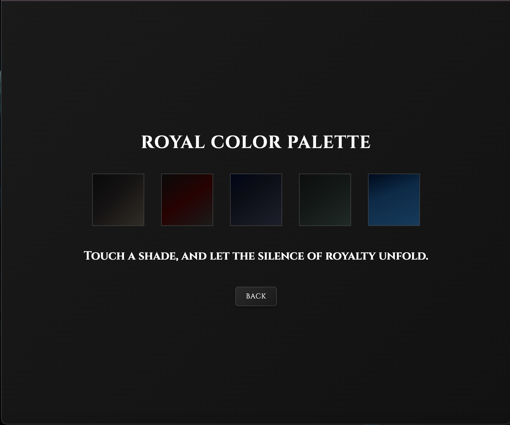
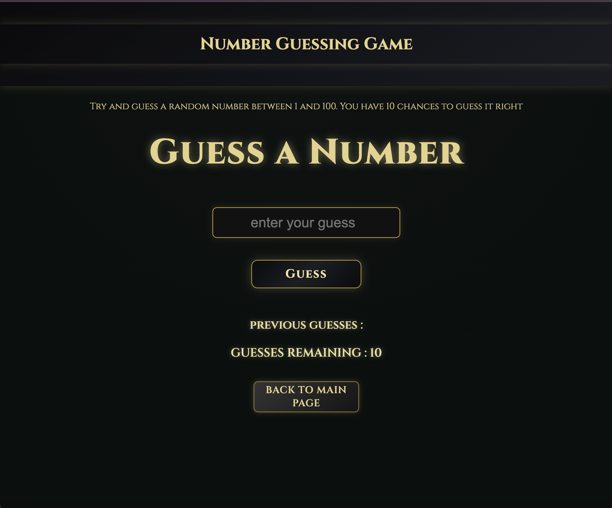
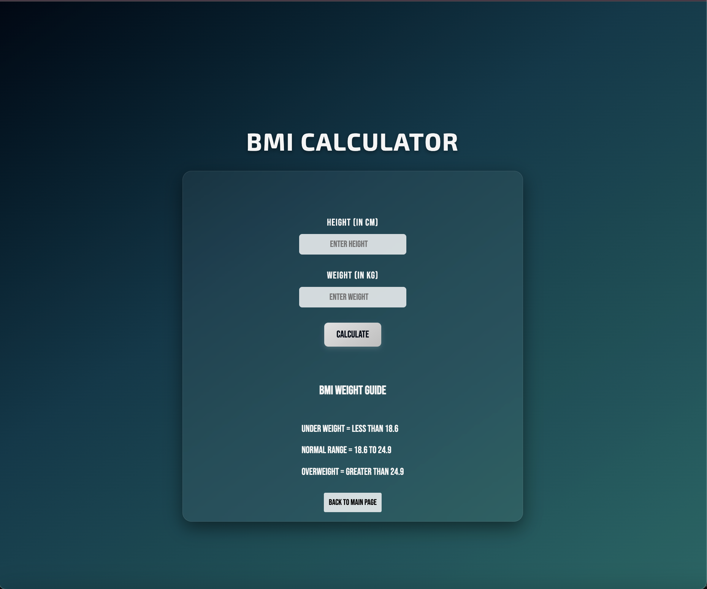
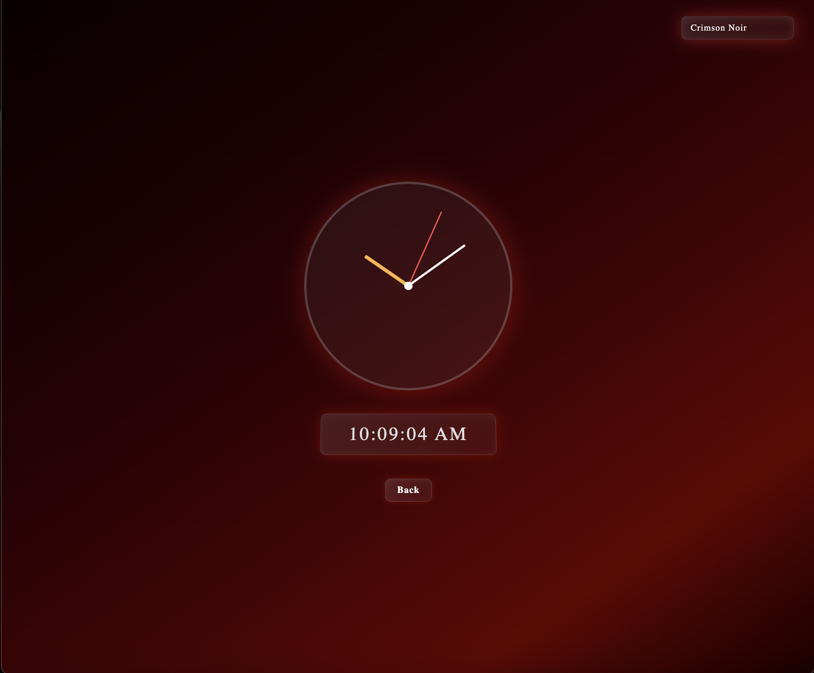
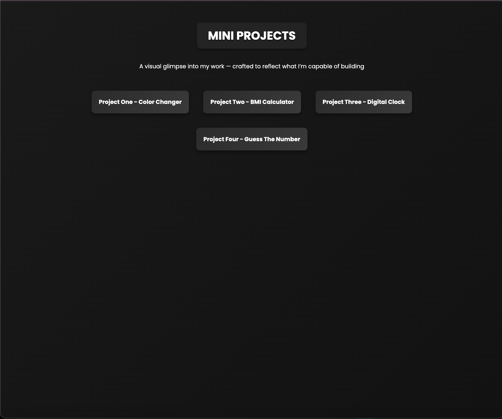

<h1 align="center">👑 Royal Frontend Mini-Apps Vault — By <strong>Adithya Subhash</strong></h1>

  

  A curated collection of interactive frontend projects —
  designed with premium UX, animations, and a bold 
  <strong>“Dark Royal Aesthetic”</strong> ✨

  
  
  
  

---

## 🏰 Live Royal Demo
> *Hosted on GitHub Pages* ✅
> (Click ↓ after deployment)

🔗 https://YOUR-USERNAME.github.io/BASIC_PROJECT/

yaml
Copy code

---

## 🌟 Featured Projects

| Project | Preview | Description | Tech |
|--------|---------|-------------|-----|
| 🔢 **Guess The Number** |  | Game logic, attempts tracking, ENTER events, animated victory/lose screens 🎉 | HTML • CSS • JS |
| ⚖️ **BMI Calculator** |  | Live BMI calculation with validation and health classification | HTML • CSS • JS |
| ⏱️ **Digital Clock** |  | Real-time clock with theme switching and AM/PM logic | HTML • CSS • JS |
| 🎨 **Color Changer** |  | Simple yet satisfying UI color switcher | HTML • CSS |

> Every project is polished with **UI animations + Royal color gradients** ✨

---

## 🧠 Core Skills Demonstrated

✅ DOM Manipulation & Events  
✅ Smooth UX (Enter-to-trigger, alerts, live validation)  
✅ Animation design (glow, transitions, floating effects)  
✅ Game logic with win/loss states  
✅ Scalable project structuring  
✅ Multi-page navigation  
✅ Frontend deployment (GitHub Pages)

---

## 📂 Directory Structure

📁 BASIC_PROJECT/
│
├── assets
│ ├── bmi.png
│ ├── clock.png
│ ├── guess.png
│ ├── main.png
│ └── royal.png
│
├── guessnumber
│ ├── index.html
│ ├── script.js
│ ├── style.css
│ ├── win.html / win.css / win.js
│ ├── lose.html / lose.css / lose.js
│
├── bmi_generator
│ ├── index.html
│ └── style.css
│
├── digital_clock
│ ├── index.html
│ ├── script.js
│ └── style.css
│
├── color_changer
│ ├── index.html
│ └── style.css
│
├── index.html ← Royal Homepage Dashboard
└── style.css ← Global Royal Theme

yaml
Copy code

---

## 🌱 Future Enhancements

- 🎚 Difficulty levels in Guess game
- 🎯 “Too High/Too Low” hints
- 🔊 Sound & particle FX
- 📱 Fully responsive layouts
- 🏆 Local storage scoring

---

## 🧍‍♂️ About Me

I’m **Adithya Subhash** —  
Frontend engineer with a belief that:

> *“Function is nothing without experience.”*

I love building:
✨ Visually striking  
🎮 Interactive  
👌 Fast-performing  
web applications.

📌 Seeking roles where I can bring UI/UX to life  
📫 Reach out → <strong>Your Email / LinkedIn</strong>

---

🔥 If this project inspired you, kindly leave a ⭐ — it pushes me to build more! 🔥
  
Made with heart ❤️, ambition 🚀, and gradients 👑

